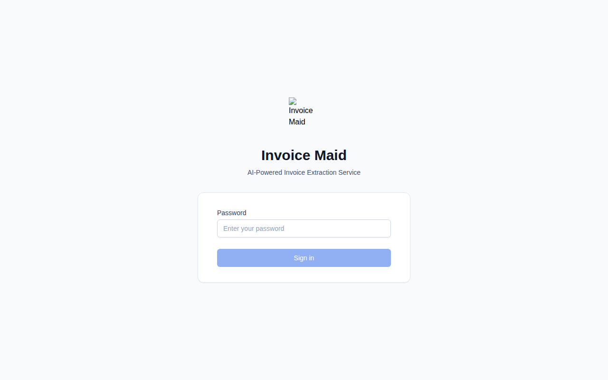
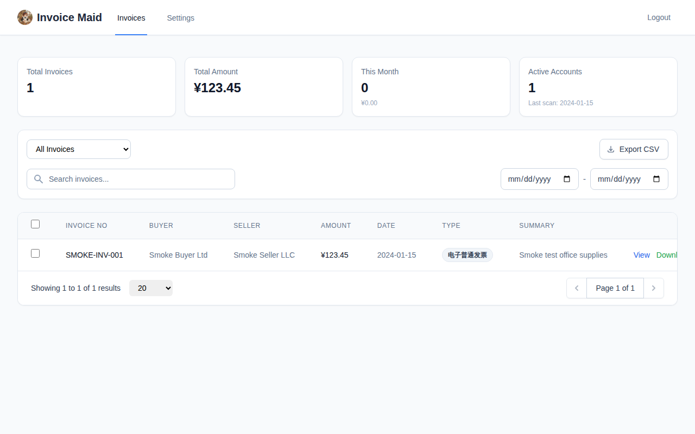
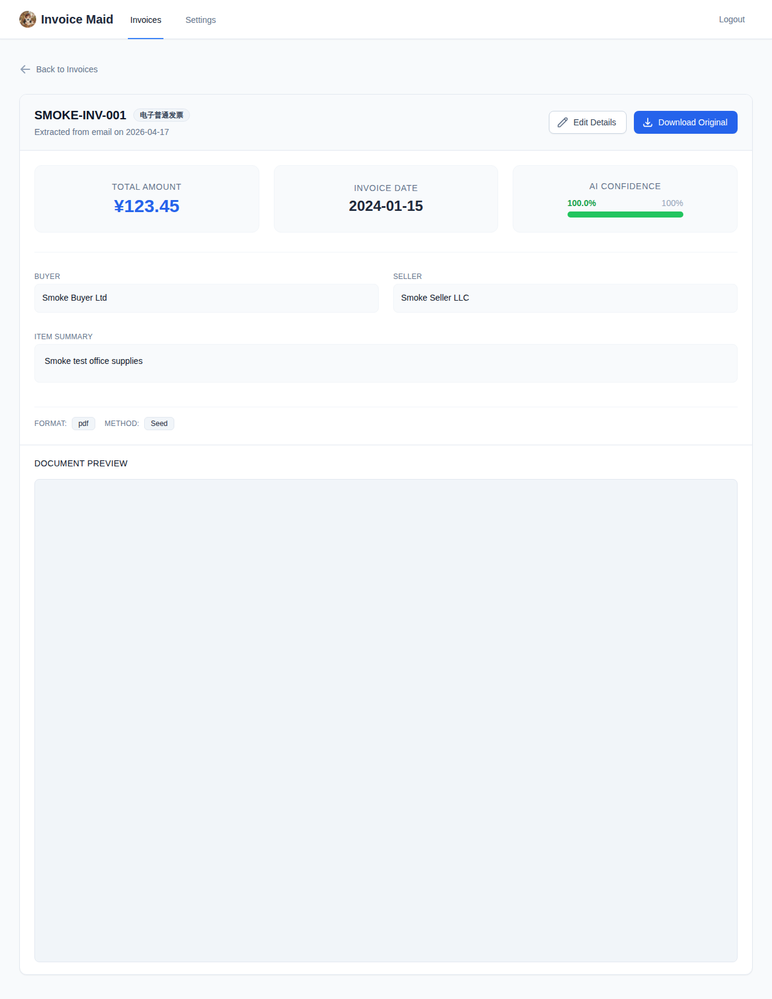
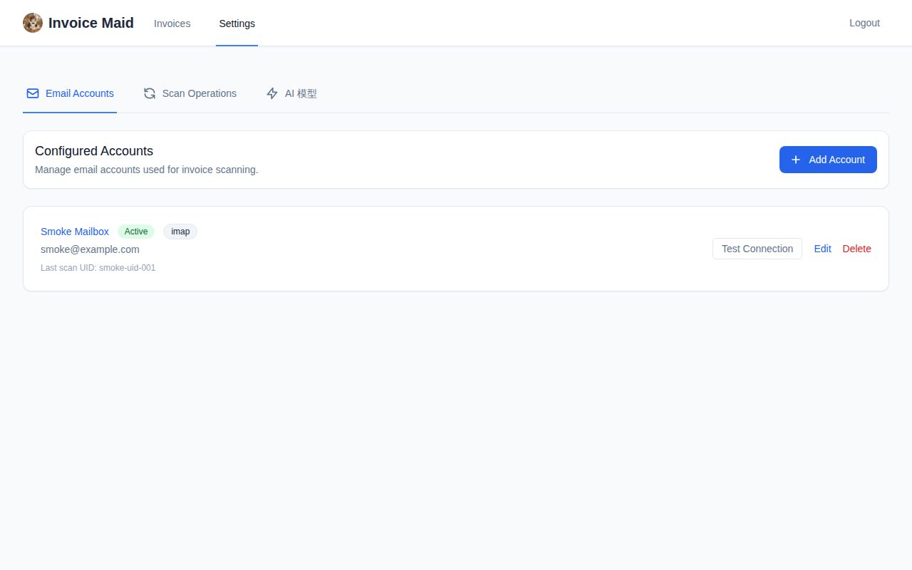
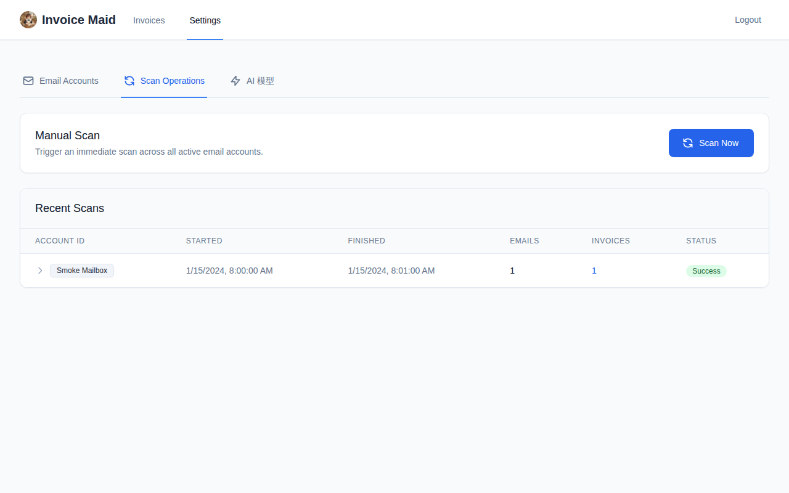
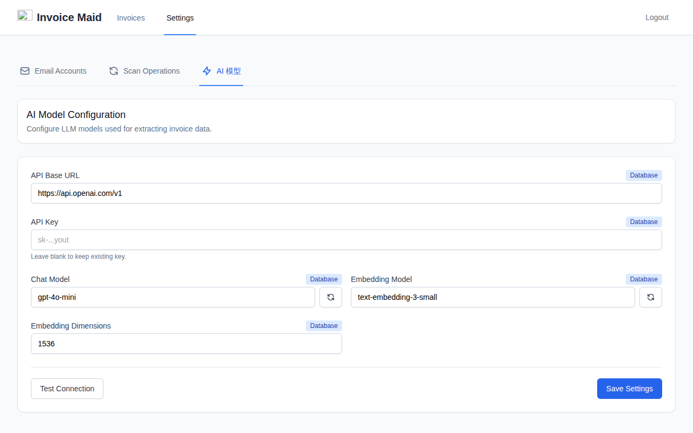

# Invoice Maid

<p align="center">
  
</p>

<p align="center">
  
</p>

<p align="center">
  <strong>AI-powered invoice extraction for self-hosted workflows.</strong><br>
  Scan inboxes, detect invoices, parse PDF / XML / OFD files, and manage everything from one clean web UI.
</p>

<p align="center">
  
  
  
  
  
  
  
</p>

---

## Why Invoice Maid?

Invoice Maid automates the boring part of invoice handling:

- Pull invoice emails from **IMAP**, **POP3**, **QQ Mail**, and **Microsoft Outlook** — including every scannable sub-folder, not just INBOX
- Use an **OpenAI-compatible LLM** to classify emails and extract invoice fields
- Parse **PDF**, **XML**, and **OFD (数电票)** invoice formats — including invoices linked from the email body
- Watch live scan progress fold-by-folder and batch-by-batch
- Search, review, correct, and export invoices from a modern web UI
- Download one invoice, batch-export as ZIP, or export filtered lists as CSV

It is designed for **single-user**, **self-hosted** deployment with minimal operational overhead. The project has shipped 30+ releases of reliability and performance work — see the [CHANGELOG](CHANGELOG.md) for the full arc.

### How it works

<p align="center">
  
</p>

Two invoice sources feed the **same** five-stage pipeline. The email scanner runs on a schedule and does its own classification (is this even an invoice?) before parsing; manual uploads declare invoice-ness up front and skip straight to parsing. The parser handles PDF / XML / OFD with QR-code decoding; an OpenAI-compatible LLM fills in whatever the deterministic parser could not extract; the dedup gate blocks duplicate invoice numbers; a successful save writes the `Invoice` row, the canonical PDF / XML / OFD file on disk, an `ExtractionLog` audit entry, an optional sqlite-vec embedding, and fires the `invoice.created` webhook.

---

## Table of Contents

- [Features](#features)
- [Screenshots](#screenshots)
- [Tech Stack](#tech-stack)
- [Prerequisites](#prerequisites)
- [Quick Start](#quick-start)
- [Configuration Reference](#configuration-reference)
- [Email Account Setup](#email-account-setup)
- [Webhooks](#webhooks)
- [Deployment](#deployment)
- [Development](#development)
- [Roadmap](#roadmap)
- [License](#license)

---

## Features

### Email ingestion

- **Multi-provider support** — IMAP, POP3, QQ Mail (via 16-char authorization code), Microsoft Outlook (OAuth2 device code flow for both personal and work / school accounts)
- **Multi-folder scan** — walks every scannable folder per account (INBOX plus Sent, Archive, and custom sub-folders); skips unchanged folders via IMAP `STATUS` preflight for massive repeat-scan speedups
- **Parallel IMAP fetch** — up to 4 concurrent IMAP connections per large folder on generic providers for ~3.35× faster cold scans (single-connection fallback is automatic when providers rate-limit)
- **QQ Mail dedicated code path** — single connection, `bulk=50`, UID-range `SEARCH` instead of `SEARCH ALL`, 1s inter-batch sleep and periodic `NOOP` keepalive — all empirically tuned for imap.qq.com's per-account connection limits and throughput ceiling
- **Scheduled processing** — configurable scan interval via APScheduler (default 60 min), with rate-limiting hygiene so nothing runs when it shouldn't
- **Incremental scanning** — saves per-folder `UIDVALIDITY` / `UIDNEXT` / `MESSAGES` / highest-UID state so subsequent scans only fetch genuinely new messages
- **Tiered email classification** — free heuristics first, cheap metadata-only LLM call second, full-body LLM only for ambiguous cases; LLM responses cached by SHA-256 for free replays

### Manual upload

- **Drag-and-drop batch upload** — drop a single file or up to 25 PDF / XML / OFD invoices at once in the web UI at `/upload`; the frontend uploads up to 3 in parallel with a per-file progress bar
- **Per-file status tracking** — each file in a batch shows its own queued / uploading / saved / failed state, its own progress %, its own error banner if rejected (with a 409-duplicate "view existing invoice" shortcut), and its own retry button so one bad file doesn't block the rest
- **Same pipeline as email** — each uploaded file hits the exact same parse → LLM enrich → dedupe → save path used by the scanner; extraction quality is identical
- **Streaming upload with progress bar** — axios `onUploadProgress` on the frontend, 256 KB chunked read on the backend so 20 MB OFD files don't pin RAM
- **Three-layer size enforcement** — nginx `client_max_body_size 25M`, ASGI `ContentSizeLimitMiddleware` (25 MB), route-level streaming counter — nothing can slip past
- **Magic-byte MIME sniffing** — first 512 bytes validated against real format signatures (not client-declared content-type); unknown or disguised files rejected with 415 before any parsing runs
- **Structured error responses** — `duplicate` → 409 with `existing_invoice_id`, `low_confidence` → 422 with the actual confidence, `not_vat_invoice` / `scam_detected` → 422 with the reason, `parse_failed` → 422 with the underlying error, `429` when the 30/min rate limit is exceeded

### Invoice intelligence

- **AI classification & extraction** — OpenAI-compatible LLMs classify emails and extract structured invoice data via the Instructor library
- **Tier-3 body-link analysis** — when an email contains download links, the LLM picks the **single best direct invoice link** instead of blindly following every URL, with a pre-download URL blocklist that rejects tracking pixels and unsubscribe links before spending any HTTP round-trip
- **Multi-format parsing** — PDF (pdfplumber + PyMuPDF), XML (lxml), OFD (easyofd) with QR code decoding via pyzbar
- **Railway + airline e-ticket support** — 铁路电子客票 (2024年第8号公告) and 航空运输电子客票行程单 (2024年第9号公告) are recognized as valid VAT invoices, including image-based PDFs where only the 20-digit invoice_no survives parsing
- **Manual correction** — edit any extracted field inline with a full audit trail (`CorrectionLog`)
- **Confidence scoring** — extraction confidence and method displayed per invoice as coloured badges
- **Duplicate detection** — composite deduplication on invoice number + email UID + attachment filename
- **Per-email extraction audit log** — `ExtractionLog` tracks why each email was saved, skipped, or failed, with drill-down links from each `ScanLog` row

### Search, export & analytics

- **Full-text search** — SQLite FTS5 with optional sqlite-vec semantic similarity
- **Saved views** — persist named search + filter combinations for daily workflows
- **CSV export** — export filtered invoice lists with one click (UTF-8 BOM, opens cleanly in Excel / Numbers / WPS)
- **Batch actions** — select multiple invoices for ZIP download (bundles an `invoices_summary.csv` metadata table alongside the PDFs) or bulk deletion
- **Spend analytics** — monthly spend, top sellers, invoice counts by type and extraction method
- **Similar invoices** — "more like this" discovery via embeddings (sqlite-vec) with FTS5 fallback

### Operations & reliability

- **Live scan telemetry** — the scan progress bar shows which account, which folder (e.g. `Folder 3/22: Archive`), and the fetching scanner's own status (`Archive: +1400 msgs`, `INBOX: unchanged, skipped`, `INBOX: searching UIDs (~35 626 msgs)`) moment by moment
- **Scan fault isolation** — one slow / broken account never takes down the rest; orphan log cleanup stamps interrupted scans as `Scan interrupted — service was restarted` instead of leaving them forever `in_progress`
- **Socket-level timeouts** — TCP handshake, per-recv, and per-parallel-worker deadlines so no IMAP session can hang the scheduler (learned the hard way against `imap.qq.com`)
- **Partial-state preservation** — when a session drops mid-fold, the per-folder highest UID seen so far is still saved, so the next scan resumes from the right place
- **Per-invocation scan options** — manually triggered scans can override scope: `unread_only`, `since=<date>`, and `reset_state` to force a full rescan
- **AI model settings in the UI** — switch LLM provider, API key, chat model, and embedding model from the browser; stored in the DB and always wins over `.env` defaults. Test both models before saving
- **Rate limiting** — brute-force protection (10 req/min/IP) on login
- **Rich health endpoint** — reports DB, scheduler, sqlite-vec, invoice count, and last-scan time for monitoring
- **Outbound webhooks** — `invoice.created` events with HMAC-SHA256 signed payloads (GitHub-style `X-Signature-256` header); delivery failures are logged but never block the scan pipeline
- **100% test coverage** — 526 unit + e2e tests, enforced in CI with `--cov-fail-under=100`

---

## Screenshots

### Login

<p align="center">
  
</p>

### Invoice Dashboard

Summary stats, search with date filters, invoice table with batch actions, saved views, and CSV export.

<p align="center">
  
</p>

### Invoice Detail

Full structured data with inline editing, confidence badge, extraction method, and PDF preview.

<p align="center">
  
</p>

### Email Account Settings

Add, edit, test, and manage email accounts. Compact scan-state summary per account (`5 folders · 47 849 messages · UID 40 993`) with a tooltip holding the raw JSON for debugging.

<p align="center">
  
</p>

### Scan Operations

Manual scan trigger with `unread_only` / `since` / `reset_state` options, live progress bar showing account, folder index, folder name, and batch-by-batch fetch status, plus scan history with per-email extraction audit drill-down.

<p align="center">
  
</p>

### AI Model Configuration

Configure your LLM provider, API key, chat model, and embedding model from the browser. Retrieve available models directly from your provider's API. Test both models before saving.

<p align="center">
  
</p>

---

## Tech Stack

| Layer | Stack |
|------|-------|
| Backend | FastAPI, SQLAlchemy 2.0 async, APScheduler, slowapi, Instructor |
| Frontend | Vue 3, Vite, Tailwind CSS, Pinia, vue-router |
| Database | SQLite (WAL), FTS5, sqlite-vec |
| AI | OpenAI-compatible HTTP API |
| Parsing | pdfplumber, PyMuPDF, easyofd, lxml, pyzbar, imap-tools, msal |
| Testing | pytest (526 tests, 100% coverage), Playwright (e2e smoke) |

Roughly 6 800 lines of Python and 3 600 lines of Vue / TypeScript.

---

## Prerequisites

- Python 3.11+
- Node.js 18+ (for frontend development only — pre-built `dist/` is committed)
- System packages:
  - `libzbar0` — QR code decoding
  - `fonts-noto-cjk` — optional, recommended for Chinese rendering

---

## Quick Start

### 1. Clone the repository
```bash
git clone https://github.com/helixzz/invoice-maid.git
cd invoice-maid/backend
```

### 2. Set up Python
```bash
python -m venv .venv
source .venv/bin/activate
pip install -e .
```

### 3. Configure the app
```bash
cp .env.example .env
# Edit .env — at minimum set the 5 required keys below
```

### 4. Generate the admin password hash
```bash
python -c "from passlib.hash import bcrypt; print(bcrypt.hash('your-password'))"
```

Paste the generated hash into `ADMIN_PASSWORD_HASH` in `.env`.

### 5. Run the server
```bash
uvicorn app.main:app --reload
```

Open `http://localhost:8000`, log in, then configure your email accounts and AI model from the Settings page.

### Docker Quick Start
```bash
cp backend/.env.example backend/.env
# Edit backend/.env with your settings
docker compose up -d
# Visit http://localhost:8000
```

For backend hot-reload, copy `docker-compose.override.yml.example` to `docker-compose.override.yml` and use `docker compose up`. Frontend source changes still need `cd frontend && npm run build` or a separate `npm run dev` workflow.

---

## Configuration Reference

| Key | Description | Example | Required |
|-----|-------------|---------|----------|
| `DATABASE_URL` | SQLAlchemy async connection string | `sqlite+aiosqlite:///./data/invoices.db` | Yes |
| `ADMIN_PASSWORD_HASH` | Bcrypt hash of the admin password | `$2b$12$...` | Yes |
| `JWT_SECRET` | Secret for signing JWT tokens | `32-char-random-string` | Yes |
| `LLM_BASE_URL` | Base URL for OpenAI-compatible API | `https://api.openai.com/v1` | Yes |
| `LLM_API_KEY` | API key for the LLM service | `sk-...` | Yes |
| `STORAGE_PATH` | Invoice file storage directory | `./data/invoices` | No |
| `JWT_EXPIRE_MINUTES` | Token expiration (minutes) | `1440` | No |
| `LLM_MODEL` | Model for classification / extraction | `gpt-4o-mini` | No |
| `LLM_EMBED_MODEL` | Model for embeddings | `text-embedding-3-small` | No |
| `EMBED_DIM` | Embedding vector dimensions | `1536` | No |
| `SCAN_INTERVAL_MINUTES` | Minutes between scheduled scans | `60` | No |
| `SQLITE_VEC_ENABLED` | Enable semantic search | `true` | No |
| `WEBHOOK_URL` | Outbound webhook endpoint | `https://example.com/hook` | No |
| `WEBHOOK_SECRET` | HMAC-SHA256 signing key for webhooks | `your-secret` | No |
| `LOG_LEVEL` | App log level (DEBUG, INFO, WARNING, ERROR, CRITICAL) | `INFO` | No |
| `OUTLOOK_PERSONAL_CLIENT_ID` | Microsoft public client ID for personal Outlook / Live / Hotmail accounts | `04b07795-8ddb-461a-bbee-02f9e1bf7b46` | No |
| `OUTLOOK_AAD_CLIENT_ID` | Microsoft public client ID for work / school Azure AD accounts | `d3590ed6-52b3-4102-aeff-aad2292ab01c` | No |

AI model settings can also be managed from the **Settings > AI 模型** page in the web UI. Database-stored values override `.env` defaults.

---

## Email Account Setup

### IMAP / POP3

Use your provider's server address, port, username, and password / app password. The generic IMAP scanner uses a 4-worker parallel fetch on folders with 500+ new UIDs and falls back to a single-connection serial fetch when the provider rate-limits.

### QQ Mail

1. Log in to QQ Mail web interface → **Settings > Account**
2. Enable **POP3 / IMAP Service**
3. Generate a **16-character Authorization Code** and use it as the password in Invoice Maid
4. Select account type **`qq`** when adding the account — this triggers the dedicated QQ code path (single connection, `bulk=50`, UID-range search, NOOP keepalive) rather than the generic IMAP path. Host-based detection (`imap.qq.com` / `imap.exmail.qq.com`) also enables this code path if you pick generic `imap` by mistake

The first full scan of a large QQ INBOX takes real wall-clock time — roughly 18–20 minutes for ~35 000 messages at QQ's per-IP throughput ceiling. Subsequent incremental scans complete in seconds because Invoice Maid restricts the IMAP `SEARCH` to `UID last+1:*` once a baseline is saved.

### Microsoft Outlook

Invoice Maid uses **OAuth2 Device Code Flow** via the Settings page. Set **username** to the mailbox email address; Invoice Maid automatically detects personal Microsoft domains (`@outlook.com`, `@hotmail.com`, `@live.*`, etc.) and picks the correct Microsoft authority / client ID for personal vs. work / school. Authentication is initiated explicitly from the UI; scans and test-connection only use cached tokens.

---

## Webhooks

When `WEBHOOK_URL` is configured, Invoice Maid sends a `POST` request for each new invoice:

```json
{
  "event": "invoice.created",
  "invoice_no": "12345678",
  "buyer": "Buyer Corp",
  "seller": "Seller Inc",
  "amount": "1234.56",
  "invoice_date": "2026-04-17",
  "invoice_type": "增值税电子普通发票",
  "confidence": 0.92
}
```

The `X-Signature-256` header contains an HMAC-SHA256 signature of the JSON body using `WEBHOOK_SECRET`, following the GitHub webhook signature format. Delivery failures are logged and never block the scan pipeline.

---

## Deployment

> **Warning**
> Run the backend with `--workers 1`. APScheduler runs in-process, and multiple workers will duplicate scheduled jobs.

### LAN tryout
```bash
cd backend
uvicorn app.main:app --host 0.0.0.0 --port 8000 --workers 1
```

Open `http://<your-lan-ip>:8000` from another device. Only do this on a trusted LAN without a reverse proxy.

### systemd
Copy `deploy/invoice-maid.service` to `/etc/systemd/system/`, update placeholders, then:

```bash
systemctl daemon-reload
systemctl enable --now invoice-maid
```

### Nginx
Use `deploy/invoice-maid.nginx.conf` as your site template. Replace `{{DOMAIN}}` and SSL paths.

### One-shot install + upgrade scripts

`deploy/install.sh` bootstraps the full production stack (service user, venv, systemd unit, nginx config, SSL via certbot) interactively on a fresh Debian / Ubuntu host. `deploy/invoice-maid-upgrade` (installed by `install.sh`) pulls the latest tag from origin, runs `alembic upgrade head`, restarts the service, and waits for `/api/v1/health` to report OK — so you can redeploy with a single command. Both scripts are safe to re-run.

---

## Development

### Backend
```bash
cd backend
pip install -e ".[dev]"
pytest --cov=app --cov-report=term-missing --cov-fail-under=100
```

100% line and branch coverage is enforced in CI.

### Frontend
```bash
cd frontend
npm install
npm run dev
```

### E2E smoke tests
```bash
cd frontend
npx playwright install chromium
npm run test:e2e
```

The Playwright smoke test spins up a throwaway backend against a fresh SQLite DB with a placeholder admin password, logs in, adds a dummy email account, and verifies the dashboard renders — all with no real credentials anywhere.

---

## Roadmap

See [ROADMAP.md](ROADMAP.md) for planned features and [CHANGELOG.md](CHANGELOG.md) for version-by-version history.

---

## License

[Apache License 2.0](LICENSE)
